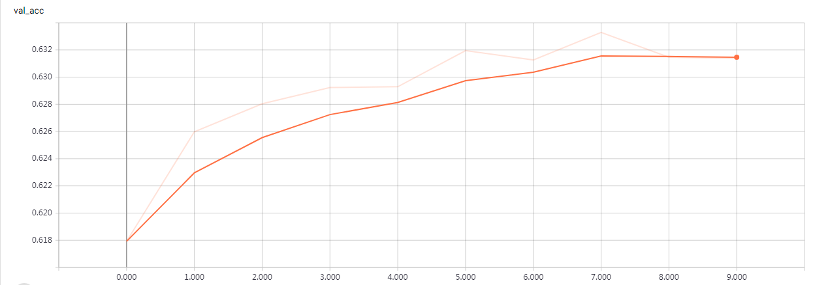

# Multidimensional LSTM for High-Frequency Time Series

Using multidimensional LSTM neural networks to create a forecast for stock forward return.

ETL类用于数据处理，主要包括数据清洗和载入。
- 数据清洗：这里将原始数据以窗宽为30，步长大小为1进行滚动，作为样本的特征集。取前30%样本标记为1，后30%样本标记为0，作为标签。
去除有缺失值的样本，将数据以(样本量, 序列长度, 特征数量)三维张量的形式存储至.HDF5文件中，所有配置参数在 `configs.json` 中可以进行定义。
- 数据载入：

MulLSTM类提供所需的样本集的生成，模型拟合，模型预测等功能。初始化时所需的各种参数均定义于 `configs.json` 中。 

训练数据：2016年01月01日 - 2016年12月31日（其中80%为训练集， 20%为验证集）

训练集损失：

训练集准确率：

验证集损失：

验证集准确率：

